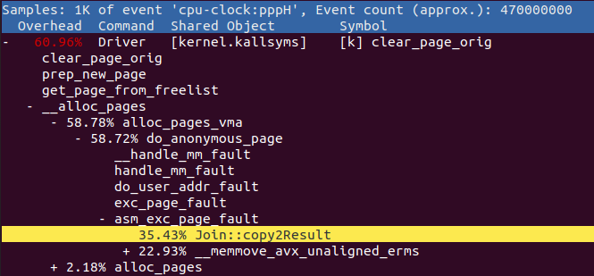

# project1 wiki

---

### Content

- Prologue, analysis
- Attempt to improve performance
- Epilogue

---

### Analysis

Project goal : improve performance of given join query operating program.

In project 1, it’s goal is to improve performance of the given program by using any kinds of technique that can be used. Before applying some twist into project 1, it is necessary to analysis bottleneck point of project1.

I found 2 critical problems of this program, and 1 trial to make running time faster.

*Driver*, which is the main program that performs join query and give result into standard output. Initial form of this program execute queries in batch with **sequential execution manner** even we have multiple cores can be used. This is the problem number 1. Also, by using *perf*, it is found that this program uses many CPU cycles to **handle page fault**. This is the problem number 2.

This program has 2 big parts. Frontend, which handles raw query (input string) into executable form that can be processed in `Joiner` part, and Backend which actually process a join query. In the backend, it performs join query with processed `QueryInfo` based on hash-join algorithm. (I also catch some bottleneck in hash-join but I can’t manage it.). In former class of professor’s, DBMS course, I learnt how to improve query execution in frontend. We can pre-calculate amount of running time of query. By this, we can choose the fastest runnable query among them. So, I tried to re-write input query.

In shorts, I tried 3 things.

1. Make *Driver* executes queries in **parallel execution**.
2. **Handle page fault** in Operator.cpp
3. Use profiles of relations and **re-write queries**.

### Parallel Execution

In out lab class, we practiced to implement thread pool in lab3. Since *Driver* gets multiple queries formed as batch, we can utilize multiple threads to execute queries concurrently.

```cpp
// Basic Driver in Pseudo code form

// in main
read_all_relations();

while(input_ends()) {
	query = read_query();
  cout << join(query);
}

// Basic Driver end
```

```cpp
// Driver with thread_pool in Pseudo code form

// thread function
thread_count++;
if (threads_are_successfully_created)
	inform_master_thread();

while(!job_done) {
  thread_result[tid] = do_given_query();
  
  work_count++;
  if (all_work_done)
    inform_master_thread();
  wait_master_thread();
}

// in main, which is master thread
create_all_threads();

wait_slave_threads();

read_all_relations();

batch = {};
while(input_ends()) {
	batch.add(read_query());
  if (end_of_batch) {
    assign_work_to_slave_threads();
    inform_slave_threads();
    wait_slave_threads();

    // when works are done,
    output(thread_result);
    batch = {};
  }
}

job_done = true;
inform_slave_threads();
clean_up_threads();

// Basic Driver end
```

Above 2 pseudo codes show difference between original Driver code and my implementation. I tried thread number option from 24~40, I got best performance when I choose 40 as a thread number.

**Improvement : 76 secs~> 41 secs.**

### Page fault

I used *perf* to find bottleneck point of Driver with thread pool. I recognized that `Operator::copy2results(~)` functions frequently use `vector push_back`. Reserving enough space for vector can prevent from frequent copying due to overflow of capacity. Thus I reserve those vectors and it made performance better. In every `Operator::require()` functions, they add empty vector into `tmpResults`. I manually add single line of code that reserves some spaces for `vector push_back`. In various experiments, I reserve each vector elements in `tmpResults` with size of `64 * 1024 * 1024`. This was the best of all.

```cpp
bool SelfJoin::require(SelectInfo info)
  // Require a column and add it to results
{
  if (requiredIUs.count(info))
    return true;
  if(input->require(info)) {
    tmpResults.emplace_back();
    tmpResults[tmpResults.size() - 1].reserve(RESERVE_SIZE); // <-- add this line
    requiredIUs.emplace(info);
    return true;
  }
  return false;
}

// ... also in other require functions
```



**Improvement : 41 secs ~> 28 secs.**

### Query re-write

When we actually join a query, program builds query tree based on the input query which is left-deep join tree. And I analyze given relations(tables), it has uniformly distributed form.

For profiling relation, I implemented profile class in Relation.hpp. This allows to track each column of each relation with max value, min value and histogram etc. I utilize this class to find simply implemented optimal query and little more advanced method to implement this query. This profile class are build when relations’ paths are fed into *Driver*, when class relation is constructed.

```cpp
class Profile {
  public:
  // bucket size 
  static const int BUCKET_SIZE = 11;
  // Total tuple count of relation's tuple.
  int tuple_count;
  // # of column in relation
  int column_count;
  // max value in such column
  int upper_bound;
  // min value in such column
  int lower_bound;
  // width of each bucket.
  int bucket_width;
  // bucket array.
  std::vector<int> bucket;

  Profile(int up, int lo, int tup_count, int col_count);
  // fill bucket with given column.
  void fill_bucket(uint64_t *column, int size);
  // calculate bucket index by constant value.
  int get_bucket_index(int value);
  // get fraction of intersection between to columns.
  float get_fraction(Profile p);
};
```

I tried 2 different algorithms, but it didn’t improve performance.

- Naive implementation `void analyzeQuery(std::string& rawQuery);`

I pre-calculate each relations’ tuple counts. Since *Driver* perform join from left to right, I put smallest relation in left-most predicate after applying filter into relations. But actually this made no difference.

**Improvement : 28 secs ~> 27.71909 secs.**

- Advanced implementation `void FindBestQuery(std::string& rawQuery);`

By using profile class, I can estimated the result of given join algorithm. For every possible join query, first check if query is valid (left-deep join tree) and then calculate join result assuming relations are uniformly distributed. For query having the lowest estimated cost, I choose that sequence of predicates and send to Joiner to perform join. But unfortunately, it didn’t work. It works well in my local desktop, but I kept receive wrong answer from test server. Though, it was worth a try.

**No improvement**

### Epilogue

Last trial of this project; query re-writer, remained latter work for me. I thought it could improve speed for 20~30% of performance since I had experiment that execution time of the same query with different sequence can vary up to 20-30%. So I expected at least subtle speed up but actual didn’t work that well. Though, I could have learnt a lot of stuffs related to concurrent programming like thread pools, library usage in C++, etc. It was hard project, but a good medicine tastes bitter.

More details are under my `{repo}/code_source1/*` with comments.

Thanks for reading my WIKI.

---

*WIKI of project1 ends.*