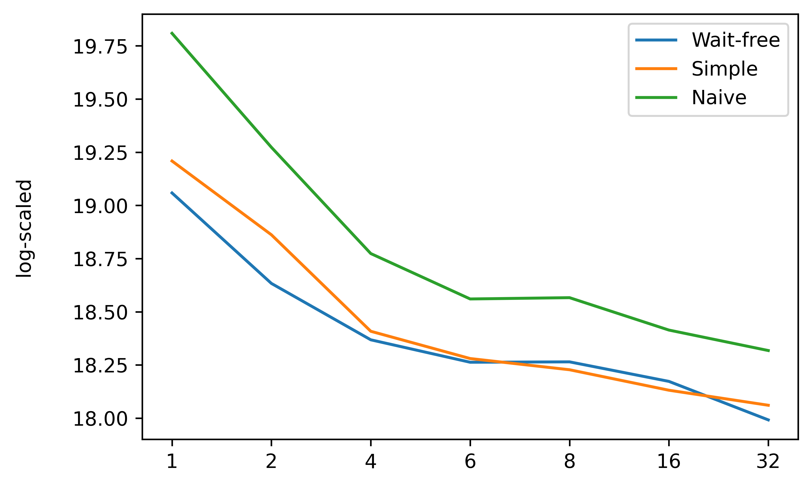
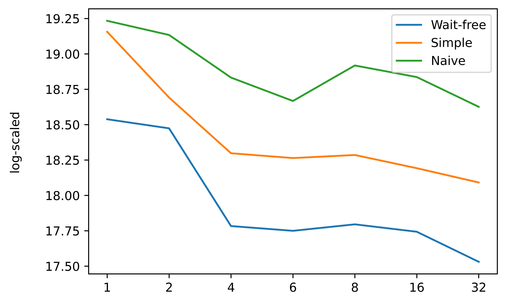
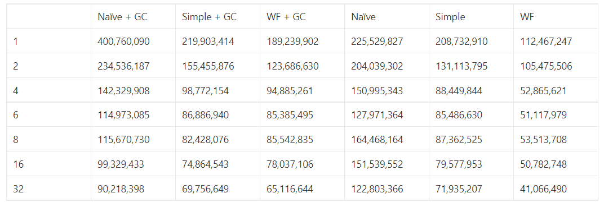

# project2 wiki

---

### Content

- Prologue
- Implementation detail
- Experiment, analysis
- Epilogue

---

### Prologue

GOAL : implement Wait-Free snapshot algorithm.

ℹ️ Compile guide for my project2

In the root directory of project2, execute `./compile.sh`

This project2 has following structure.

```text
├── asset ------------------------- (1)
│   ├── runSafe.cpp
│   └── runSimpleSnap.cpp
├── CMakeLists.txt ---------------- (2)
├── compile.sh -------------------- (3)
├── include ----------------------- (4)
│   ├── GC.h
│   ├── ISnapshot.h
│   ├── NaiveSnapshot.h
│   ├── SimpleSnapshot.h
│   ├── StampedValue.h
│   └── WFSnapshot.h
├── NaiveSnapshot.cpp ------------- (5)
├── SimpleSnapshot.cpp ------------ (5)
├── WFSnapshot.cpp ---------------- (5)
├── test ---------------------------(6)
│   ├── CMakeLists.txt
│   └── snapshot_test.cc
├── config.txt -------------------- (7)
├── run.cpp ----------------------- (8)
└── run --------------------------- (9)
```

1. Legacy run source code. (From basic to `atomic wait-free snapshot`, I tried `sequential snapshot` and `simple snapshot`. I will discuss in latter part of WIKI.)
2. Cmake file for build project2.
3. Shell script for project2 build.
4. Header files for 3 snapshot algorithms, simple garbage collection and stamped value.
5. Source code of 3 snapshot algorithms.
6. Gtest for snapshot algorithm.
7. Configuration file for executing different snapshot algorithm in run program. Details are in configuration file. 
    1. _1_ for `Naive snapshot` (sequential snapshot)
    2. _2_ for `Simple snapshot`
    3. _3_ for `Wait-free snapshot` (default option for project2)
    4. Note that the 1st line of config.txt should be 1, 2 or 3. Other number will make run program don’t perform any snapshot algorithm. 
8. Driver code for run program.
9. Driver program.

---

## Implementation details.

For understanding “atomic snapshot”, we need to define what is atomic snapshot. Assume that we have N threads, and each thread has a single atomic MRSW registers. We can treat N threads as an array of MRMW registers that has length of N. For each index `i`, ith thread can update, and every other thread can read or scan ith register.


We call an instantaneous view of an array of atomic register as “atomic snapshot”, like getting screenshot of monitor. For single threaded program, we can easily get atomic snapshot by scanning register array, but in multi-core environment, naive scanning doesn’t guarantee atomic snapshot. 

To handle this problem, we can make each scan operation to perform multiple collect operation until they get double clean collect; there’s no update between old collect and new collect. This algorithm gives wait-free for update, but not for scan.

We can make scan operation wait-free by update operation perform another scan, which makes scan operation ends in 1 + N(= thread number) collect operation due to Pigeon’s hole principle.

So, I decided to implement 3 algorithms, `naive snapshot`, `simple snapshot`, and `atomic snapshot` and compare those 3 algorithms.

Before explanation of snapshot algorithm, it is very crucial to think about the difference between `Java` and `C++` handle objects.

### How Java and C++ handle object.

There are so many difference between `Java` and `C++` handle object, but for this project2, we need to focus how they interpret object. Assume we have simple class called `ClassSimple`. that has 2 field `int a`, `int b`.

```cpp
// class written in C++ manner.
class ClassSimple {
public:
  long a;
  long b;
  ClassSimple(long _a, long _b) {
    a = _a;
    b = _b;
  }
}
```

```cpp
// For C++, we can create a object by code below.
ClassSimple object(1, 2); //object created on the stack

// In Java we can write
ClassSimple object = new ClassSimple(1, 2); //obj is just a reference(not an object)
```

Making object in Java and C++ looks similar, but in C++, this assignment operation is not atomic. We can divide this operation with following codes.

```java
object.a = 1;
object.b = 2;
```

So, using textbook’s snapshot algorithm implementation written in Java, it won’t satisfy the property of MRSW register. Therefore, we need to handle class objects with it’s memory address.

- Check difference with machine code
    
    ```cpp
    test temp; 
        1327: 48 8d 45 d0           lea    -0x30(%rbp),%rax 
        132b: 48 89 c7              mov    %rax,%rdi 
        132e: e8 cb 04 00 00        call   17fe <_ZN4testC1Ev> 
     
    ... 
    temp = a; 
        1338: 48 8b 05 21 4e 00 00  mov    0x4e21(%rip),%rax        # 6160 <a> 
        133f: 48 8b 15 22 4e 00 00  mov    0x4e22(%rip),%rdx        # 6168 <a+0x8>
    ```
    
    ```cpp
    test *temp;
    
    ...
    temp = b;
        13f8: 48 8b 05 71 4d 00 00  mov    0x4d71(%rip),%rax        # 6170 <b>
        13ff: 48 89 45 e8           mov    %rax,-0x18(%rbp)
    ```
    
    I wrote a test code to check assignment of object is not atomic. `test` class contains 2 long integer variables, so this object can’t be stored and loaded with single instruction. (above code needs 2 distinct mov instructions to assign object to `temp` variable.). Second machine code states that assigning address of object, which is 8 bytes, can be done assign atomically. This also uses 2 mov instruction, but they reference to `temp` variable only once.
    
    This test heavily depends on hardware architecture and compiler optimization. So in my opinion, we can’t conclude writing object address is atomic, but writing object directly into variable is definitely not atomic for object that is bigger than 8 bytes. Thus, rewriting textbook code will lead to wrong behavior.
    

### Memory leak

With previous inference, we should write object address into register array. So, we need to allocate new object when we make new value for register array. This makes us to manage memory usage, checking memory leak problem. 

In fact, I had problem with dealing memory leak problem. If I ignore this problem, then small virtual machine that has few main memory wouldn’t process for 60 seconds. I first tried to implement those algorithm with unique pointer, but it was hard to define ownership of object in `Wait-free snapshot`. Another solution was `shared_ptr`, but this is not thread-safe, and there’s a thread-safe version with mutex or atomic instruction for checking reference count. Utilizing atomic instruction or locking mechanism makes contradiction to project2, because it makes atomic snapshot from basic safe SRSW register.

Finally, I decided to make simple Garbage Collection mechanism to handle memory leak problem.

### Garbage Collection

In project2, I made a Garbage Collection module in `include/GC.h`. It simply holds old values with `std::deque`, and release when queue holds more object than limitation. 

```cpp
template <typename T>
class GC {
  private:
    std::deque<std::deque<T*> > gc;
  public:
    unsigned int limit;
    int capacity;

    GC(unsigned int _limit, int _capa);
    ~GC();

    void clean(int id) {
      if (id < 0 || id >= capacity) {
        return;
      }

      if (gc[id].size() > limit) {
        delete gc[id][0];
        gc[id].pop_front();
      }
    }

    void push(int id, T *oldValue) {
      gc[id].push_back(oldValue);
    }
};
```

For every thread, they need to check for queue hits limitation before they perform update operation. When update is ready to finish, they push old value into garbage collection object.

This actually worked well for local machine, but the problem was deciding limitation number for each snapshot algorithms. I couldn’t guarantee this garbage collection will work in other machine like test server for class. Some asynchronous event could delay a thread for very long time, and that thread could use invalid object later.

By asking professor about this problem, I could get a solution `epoch-based GC` which will be covered in future class. I was too late to implement this mechanism as well as this method is above of project2’s scope. So I decided to believe test server’s huge main memory, letting memory leak problem stay in project2.

But I made 2 different experiment with GC and without GC. Result will be discussed in later part in this WIKI.

### 3 Algorithms

3 algorithms share interface `ISnapShot` that has `Scan()`, `Update(int, int)` operation. I use this interface to dynamically choose algorithm with `config.txt` file. 

Algorithms are actually implemented in Java manner in textbook. So I could just utilize them. But I mentioned before, Java treats object different with C++, I had to adjust some parts of the code. In this section, I will briefly introduce 3 algorithms.

- Sequential snapshot. (or Naive snapshot)

For understanding what is snapshot, `Sequential snapshot` will be great start for getting insight of “atomic snapshot”. For single thread execution, It will be fine to collect register array by itself. There won’t be any interleaving write operation between the interval of scan operation, we can just read through register array.

But within multi-core environment, it won’t make atomic snapshot. But it will give upper bound(or maximum counts of atomic snapshot) of collect operation with N threads, because this algorithm performs single collect operation per update function.

 

- Simple snapshot.

`Simple snapshot` performs unbounded collect operation to obtain “a clean double collect”. Latter part of the clean double collect can be utilize as atomic snapshot, but it is not wait free for scan operation because it is not bounded for scan operation until they get a clean double collect.

`Simple snapshot` will be compared with `Wait-free snapshot` for performance perspective of obtaining snapshot.

- Wait-free snapshot.

`WF snapshot` performs bounded collect operations, which makes scan operation wait-free. By cooperating scan operation with update operation. For every update operation, they have to perform scan and obtain atomic snapshot. Scan operation can utilize this scan as their atomic snapshot when they detect 2 distinct update from single thread.

### GTEST

For checking correctness and malfunction, I tried `gtest` for testing.

First, test program create 3 threads and each thread performs 1,000 scan operation, then put them into log array. Check each snapshot has valid value and last snapshot should be always `[1, 2, 3]`

---

## Experiment, analysis

- With GC



Following graph represents update operation throughput with 3 snapshot algorithms. X-axis represents the number of threads, and Y-axis represents the number of update operations with log-scaled. There are several key points of this experiment.

1. single thread gives best result.
    
    The collection operation is `O(n)`, when n is number of thread. So when there are multi threads are running in the `run` program, collect becomes more heavy operation. Which would bound single thread execution be the best result.
    
2. Naive algorithm suggests upper bound of update operation.
    
    This is because Naive snapshot algorithm perform scan by just calling a collect function. So this would be upper bound of any snapshot algorithm.
    
3. Why 6 threads?
    
    My local virtual machine support maximum 6 cores, so I added to experiment option. Interestingly, `8 threads` is better than `6 thread` which contradicts to `point number 1`. I guess some scheduling may give more chance for worker thread to collect more snap.
    

- Without GC



I also tested without GC, It gave worse result than snapshot with GC. I guess memory allocation overhead could affect to this result.

Table below represents actual update count.



---

### Epilogue

Project2 seems not that hard, but it keeps get harder when I understand about atomic snapshot. First, I tried to implement WFsnapshot with object assignment, but it was wrong. So I tried with `unique_ptr`, `shared_ptr` but I thought this might use atomic instruction or locking mechanism, so I retried with GC. Finally today, I realized that GC was not necessary for this project, I made final wait free atomic snapshot with memory leak.

Describing flow of my project2 made quite long WIKI. So I skip some code explanations. 

More details are under my `{repo}/project2/*` with comments.

Thanks for reading my WIKI.

---

*WIKI of project2 ends.*