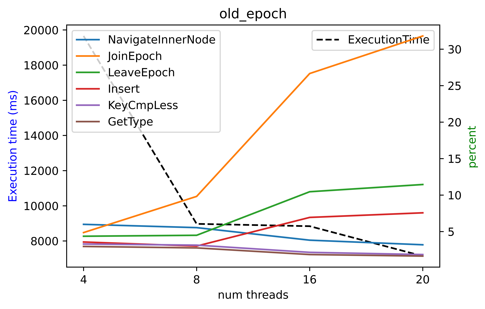
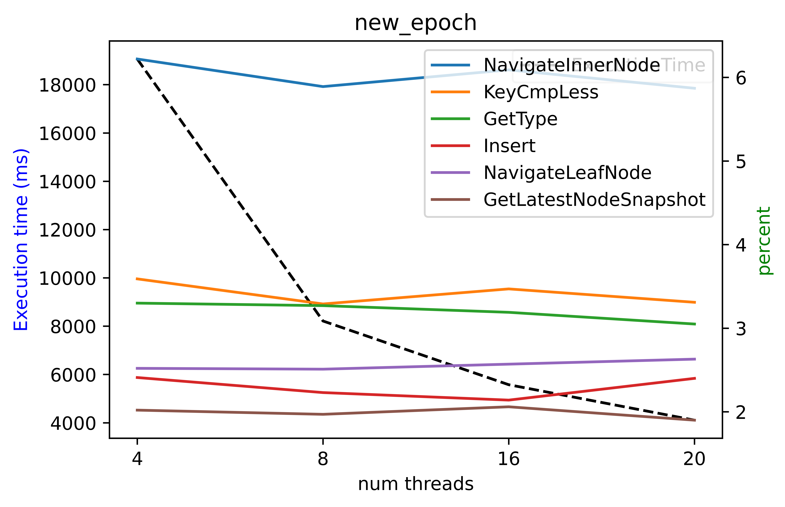
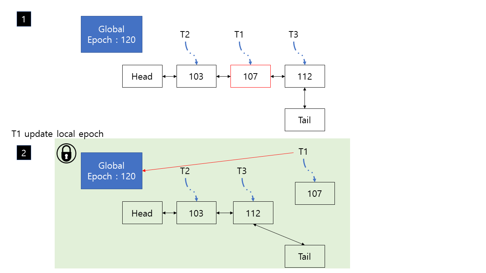
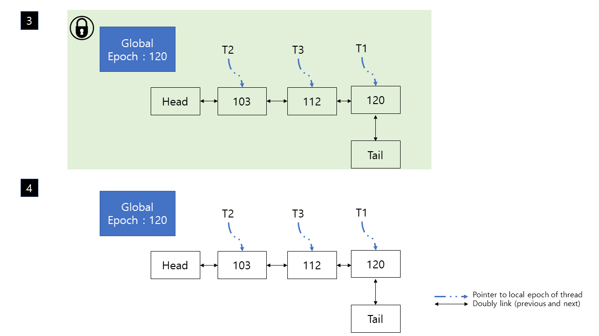
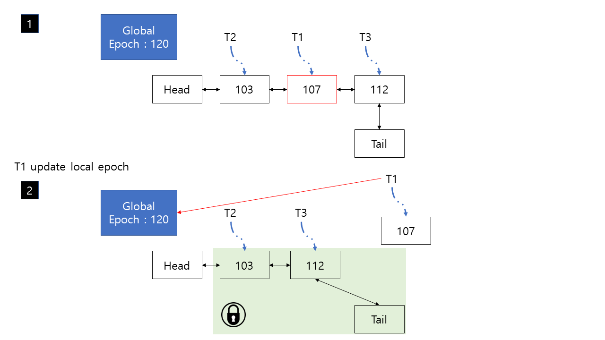
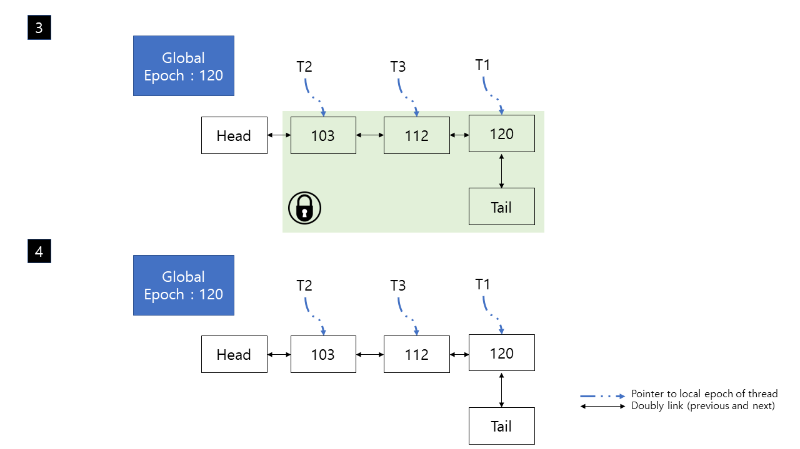
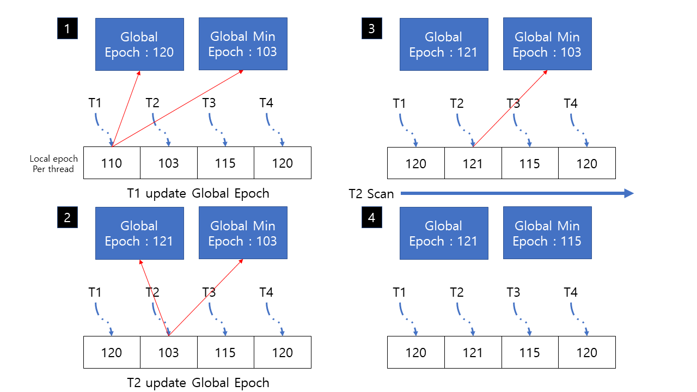

# project3 milestone1

---

### Content

- Prologue, Analysis
- Global min epoch
- Expectation

---

### Prologue

Milestone1 : Find a problem and propose a design to solve the issue.

First, I want to define the workload for this project. For every Insert, I verify insert operation with `GetValue` to make sure `bwtree` maintains its invariant; key could be found after it has been inserted and yet deleted. In short, Every time I `Insert`, I execute `GetValue` with the same key. Given program `bwtreeplus` tries to insert until worker threads succeeded to insert 1M keys. My version of `bwtreeplus` also tries insert until 1M successes, but do extra `GetValue`. 

With this workload, I could find some bottleneck point with `perf` tool. I use this script to identify some ‘hot’ function during their execution.

```bash
#!/bin/bash
cmake --build debug
perf record -g ./debug/bin/bwtreeplus
perf report -g graph --no-children
```

I executed this script with different number of core, 4, 8, 16 and 20. I got result below. (In test server, 20 cores)



I realized that some of garbage collection methods are not scalable and cause huge overhead during the execution. I focused on `JoinEpoch` and `LeaveEpoch`, so I scan trough source code. I could easily understand the function. They manage reference count to epoch nodes and append garbage object to epoch node with `CAS` operation. If many threads are actively do read/write to tree, intensive `CAS` operation would create huge contention to epoch manager. 

So, I tried to think about **thread-wise epoch based GC manager**, but while I understanding source code, I found a GC manager that is already implemented as thread-wise manner. I could simply comment out `#define USD_OLD_EPOCH` in the source code. I tried some experiment with new epoch based GC manager, the results are below. (In test server)



With this experiment, reading the open bwtree paper, I could find that the author pointed out **global GC epoch manager**, which is **centralized GC**, has poor scalability and this is the reason of bottleneck due to cache coherence. So **thread-wise GC**, **decentralized GC** was implemented to overcome this bottleneck.

I was little sad that the problem that I found was already resolved by author, but with some further analysis, I could notice some overhead between centralized GC and decentralized GC. I tried profiling  `BwTreeBase` made following overhead. (In test server)

```bash
# Overhead in new GC
  Overhead  Command     Shared Obj  Symbol
-    1.42%  bwtreeplus  bwtreeplus  [.] bwtree::BwTreeBase::GetGlobalEpoch
   - 1.41% bwtree::BwTreeBase::GetGlobalEpoch
      - 1.38% bwtree::BwTreeBase::UpdateLastActiveEpoch
         + 0.71% bwtree::BwTree<some template>::EpochManager::LeaveEpoch
         + 0.67% bwtree::BwTree<some template>::EpochManager::JoinEpoch
-    0.92%  bwtreeplus  bwtreeplus  [.] bwtree::BwTreeBase::GetInnerDeltaChainLengthThreshold
   - bwtree::BwTreeBase::GetInnerDeltaChainLengthThreshold
      + 0.90% bwtree::BwTree<some template>::TryConsolidateNode
+    0.69%  bwtreeplus  bwtreeplus  [.] bwtree::BwTreeBase::GetGCMetaData
     0.51%  bwtreeplus  bwtreeplus  [.] bwtree::BwTreeBase::GetCurrentGCMetaData
     0.43%  bwtreeplus  bwtreeplus  [.] bwtree::BwTreeBase::GetLeafDeltaChainLengthThreshold
     0.36%  bwtreeplus  bwtreeplus  [.] bwtree::BwTreeBase::UpdateLastActiveEpoch
     0.26%  bwtreeplus  bwtreeplus  [.] TLS wrapper function for bwtree::BwTreeBase::gc_id
     0.09%  bwtreeplus  bwtreeplus  [.] bwtree::BwTreeBase::SummarizeGCEpoch
     0.07%  bwtreeplus  bwtreeplus  [.] bwtree::BwTreeBase::GetInnerNodeSizeUpperThreshold
     0.06%  bwtreeplus  bwtreeplus  [.] bwtree::BwTreeBase::GetLeafNodeSizeUpperThreshold
     0.01%  bwtreeplus  bwtreeplus  [.] bwtree::BwTreeBase::GetInnerNodeSizeLowerThreshold
     0.00%  bwtreeplus  bwtreeplus  [.] bwtree::BwTreeBase::GarbageNode::GarbageNode
     0.00%  bwtreeplus  bwtreeplus  [.] bwtree::BwTreeBase::GetLeafNodeSizeLowerThreshold

# Overhead in old GC
  Overhead  Command     Shared Obj  Symbol
     0.16%  bwtreeplus  bwtreeplus  [.] bwtree::BwTreeBase::GetInnerDeltaChainLengthThreshold
     0.06%  bwtreeplus  bwtreeplus  [.] bwtree::BwTreeBase::GetLeafDeltaChainLengthThreshold
     0.01%  bwtreeplus  bwtreeplus  [.] bwtree::BwTreeBase::GetInnerNodeSizeUpperThreshold
     0.01%  bwtreeplus  bwtreeplus  [.] bwtree::BwTreeBase::GetLeafNodeSizeUpperThreshold
     0.00%  bwtreeplus  bwtreeplus  [.] bwtree::BwTreeBase::GetInnerNodeSizeLowerThreshold
     0.00%  bwtreeplus  bwtreeplus  [.] bwtree::BwTreeBase::GetLeafNodeSizeLowerThreshold
```

Finally, we can find that some overhead made by new GC by applying complement between two perf result. Considering new GC design, I got idea to introduce new variable `global minimum epoch` to reduce accessing Global Epoch and thread’s local epoch values with `GetGCMetaData` , `GetGlobalEpoch`. I think using `GetGlobalEpoch` is inevitable because we need to correctly manage local thread’s epoch value, but accessing other thread’s local variable wouldn’t be necessary if I manage global minimum value wisely.

```bash
# complement of new GC and old GC
  Overhead  Command     Shared Obj  Symbol
-    1.42%  bwtreeplus  bwtreeplus  [.] bwtree::BwTreeBase::GetGlobalEpoch
   - 1.41% bwtree::BwTreeBase::GetGlobalEpoch
      - 1.38% bwtree::BwTreeBase::UpdateLastActiveEpoch
         + 0.71% bwtree::BwTree<some template>::EpochManager::LeaveEpoch
         + 0.67% bwtree::BwTree<some template>::EpochManager::JoinEpoch
+    0.69%  bwtreeplus  bwtreeplus  [.] bwtree::BwTreeBase::GetGCMetaData
     0.51%  bwtreeplus  bwtreeplus  [.] bwtree::BwTreeBase::GetCurrentGCMetaData
     0.36%  bwtreeplus  bwtreeplus  [.] bwtree::BwTreeBase::UpdateLastActiveEpoch
     0.26%  bwtreeplus  bwtreeplus  [.] TLS wrapper function for bwtree::BwTreeBase::gc_id
     0.09%  bwtreeplus  bwtreeplus  [.] bwtree::BwTreeBase::SummarizeGCEpoch
     0.00%  bwtreeplus  bwtreeplus  [.] bwtree::BwTreeBase::GarbageNode::GarbageNode
```

One more thing I found is that new GC makes more page fault than old version. I tried to find the reason of page fault, it was `__stpncpy_sse2_unaligned` in glibc, but I didn’t get the right point. I would work more on this part with actual implementation. (Test in local machine. 4 CPUs, total 4 threads)

```bash
# result of perf
# in old epoch
0.00% bwtreeplus [kernel.kallsyms] [k] clear_page_orig

# in new epoch 
1.76% bwtreeplus [kernel.kallsyms] [k] clear_page_orig
```

---

## Global Minimum Epoch

With this analysis, I think I could **improve decentralized GC** with introducing new variable, `Global Minimum Epoch`. In new version of GC, it uses a method call `SummarizeGCEpoch`, basically traverse through working thread’s local epoch and get minimum epoch number. With found min epoch, they perform actual garbage collection.

In concurrent environment with more cores, getting minimum value of local epoch would cause more overheads. So I tried to reduce this overhead with 3 different logics to manage `Global Minimum Epoch`. In my opinion, design 1, 2 are not practical because it would invoke another overhead we got from old GC manager. Design 1, 2 are just some steps for design 3.

---

1. lock-based doubly linked list.

Figures will help you to understand the logic I designed. Lock-based doubly linked list simply manage thread’s local variable in sorted state. When thread tries to perform GC, and need minimum value among local thread’s epoch value, the thread can get min value with accessing `head` of list. When we update thread’s local epoch, we just pop node from list, then append it before `tail` of the list. Due to concurrent access to list, we need some mechanism for protecting shared data structure. In first step, I would choose big mutex to protect it. But mutex would make huge contention as old GC.





---

1. Fine-Grained synchronization of logic 1.

Second design is improved version of logic1. Since this list would be accessed by multiple threads, it could raise another bottleneck. Using fine-grained lock could make less contention to shared object, however every update of local epoch value, thread need to hold lock to `tail` node, so it would make similar amount of contention in design 1.





---

1. **Lazy synchronization of `Global Minimum Epoch`**

Lastly, I made some lazy synchronization to manage global minimum epoch variable. 

1. When a thread tries to update its local epoch, check `Global Epoch` and `Global Min Epoch`.
2. Check if its local epoch is the same as `Global Min Epoch.`
3. If it is, then perform `Scan` operation on local epoch array, and calculate new `Global Min Epoch` then update its epoch to `Global Epoch`
4. If not, just update its epoch value to `Global Epoch`

This idea comes from power of `local min epoch`. No other thread can perform GC before some old living thread still lives. So actual boss to change global min epoch is the thread that lives the most. 



---

## Expectation

I will implement logic 3, then check if has positive effect to `bwtree`. Also, if I can have chance to implement logic 1 and 2, I will check whether they have overhead as old GC.

As an expectation of this propose, I would say **accessing time to local epoch would be alleviated** than before. I guess its not a game changer to `bwtree`, but I think accessing too much on local epoch array is overwork.

*end of milestone1*