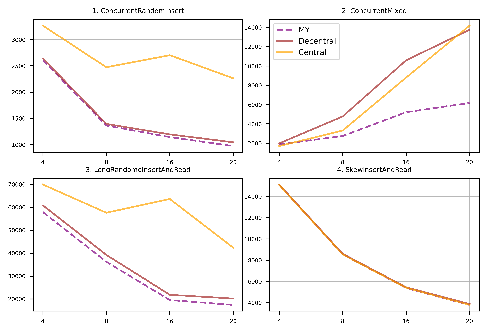

# project3 milestone2

---

### Content

- How to build
- Prologue, About Design
- Implementation Details
- Test, Performance Analysis
- Epilogue

---

## How to build

At the root directory, execute following commands

```bash
repo         $ cd project3
repo/project3$ ./compile.sh
```

Then the `bwtree_test` and `bwtreeplus` will be built at `repo/project3/build/bin/`.

## Prologue

Bwtree internally support 2 types of Garbage Collection mechanism, **Centralized Garbage Collection** and **Decentralized Garbage Collection**. In milestone1, I noticed that using Centralized GC ruins the scalability of bwtree, hence author of open bwtree implemented Decentralized GC. Before dive into details of project3, it’s worth to mention about the structure and key logics of both Centralized GC and Decentralized GC.

Last but not least, we need to know how GC thread works in the bwtree. GC thread starts when `EpochManager::StartThread` function has been called. It could be called from outer process or by bwtree constructor. When GC thread begins, it perform following pseudo code until bwtree is exited. 

```cpp
// ThreadFunc looks like this
void ThreadFunc() {
  while (exited == false) {
    PerformGarbageCollection();

    // Sleep for 50 ms (default GC_INTERVAL)
    duration = GC_INTERVAL;
    sleep(duration);
  }
}
```

In order to create new GC mechanism, we simply design new `PerformGarbageCollection()` and plug it into GC thread. Let’s continue to see how Centralized GC and Decentralized prepare GC and how they perform garbage collection.

### Centralized GC


Above figure shows a simple example of 3 worker threads are running. In this garbage collection, dedicated GC thread makes an `EpochNode` when it wakes from `sleep(duration)`. Epoch node is consisted with an atomic integer counter, and an atomic garbage list, and next pointer for pointing next epoch node. Since epoch node list is managed by GC thread, which is sequential execution, we don’t need to take care about concurrent issue, but atomic counter and atomic list makes some huge contention. 

First, atomic counter represents the number of participating in current epoch round. We can simple treat as a reference counter modified with atomic RMW operation `fetch_add`, `fetch_sub`. When reference count becomes zero, we could safely execute garbage collection for such epoch node’s garbage list. Secondly, atomic list is for maintaining garbage node in some epoch round. Worker threads use `CAS` operation to append its garbage node that has been made from arbitrary work.

This two kinds of atomic variables are accessed by worker threads. When all worker threads are actively join and leave into `EpochNode`, this cause a huge overhead to bwtree. I had pointed out this in milestone1, that Centralized GC ruins scalability a lot. The more threads run, the more overhead grows due to Centralized GC.

### Decentralized GC


Let’s see how author implemented Decentralized GC to overcome previous issue. The figure shows an example for 4 worker threads are running. Each worker thread has their own `GCMetatData`, that contains a local epoch value, and a list and a counter for tracking how many nodes are in the list. Dedicated GC thread will simply manage global epoch value, and each worker thread will maintain their own garbage. When node count become larger than `GC_NODE_COUNT_THREADHOLD`(1024 default) such worker thread perform GC on their garbage list. They first calculate minimum epoch value of all worker threads `last_active_epoch` value, then they perform GC when such garbage node that has smaller epoch value. Because each thread append its garbage in sorted manner, we can read through list until delete epoch gets great or equal.

Actually Decentralized GC resolves bottleneck point that I found in Centralized version, but I made a guess that this logic could be improved. When threads need to perform a GC, they need to calculate the min value of local epoch. It would be useful when we can maintain global min epoch wisely.

### Design Proposal


In milestone1, I discovered Centralized GC becomes bottleneck point when the number of threads gets larger. Also, using Decentralized GC makes huge performance enhancement than using Centralized one. Based on Centralized GC, I create new variable **“Global Minimum Epoch”**. We know calculating minimum epoch needs full scan through all threads local GCMetadata, with this insight, I proposed some algorithm to manage global minimum epoch in milestone1. But with deeper understanding of Decentralized GC, I realized this kind of algorithm isn’t very efficient. 


When we execute bwtree test with sufficient number of threads, all participating threads’ local epoch values are usually sync with global epoch since they always call `UpdateLastActiveEpoch` with `Join epoch` and `Leave epoch`. With naïve calculation, suppose that 10 worker threads made total 10M `Insert` in 1 seconds. `GC_INTERVAL` is set as 50 milliseconds, so epoch will reach 20 when all works are done. Each threads will asymptotically performs 1M `Insert` in total, and assume `Insert` do `Join epoch` at the start of operation, and `Leave epoch` at the end of the operation. So, each thread will update it’s local epoch about 100K times by calling `UpdateLastActive` per single epoch. This makes huge number of full scan through all thread’s `GCMetaData`, and even worse when there are more worker threads. This algorithm scans whole thread local epoch value when thread local value is the same as global min epoch, even global min epoch won’t be changed. In such environment that CPU has sufficient cores than the number of worker threads in bwtree, we need some different approach to deal with epoch values. So I want to introduce a flag variable to represent the “intention to participate certain round of epoch of threads”. 


Each worker threads will set a flag to inform “I will do some stuffs in this round of epoch” to dedicated GC thread. We know that GC thread increases a global epoch then sleeps for predefined amount of time, `GC_INTERVAL`. During the GC thread is sleeping, worker threads will set flag and update its value to global epoch, and do some extra works. This works will be explained in Implement section. When GC thread wakes up, it will collect all thread local values, and unset all local threads’ flags. With this design, `Join Epoch` and `Leave Epoch` will check thread’s flag and if it is unset, then update its local epoch value and otherwise will just return to their workload. In short, all thread will just perform small update once and just read their flag in single epoch round.

Graph below represents overview of performance comparison between my design, Decentralized GC and Centralized GC. Let’s dive into implementation. Workload used in this test performs 1M `Insert`, and when every `Insert` is done, we check key is actually in the tree by `GetValue`. 


---

## Implementation Details

### Addition to BwTreeBase

```cpp
class BwTreeBase {
  private:

  // ~~ some codes

  // This is current min epoch
  // Use min epoch instead of SummarizeGCEpoch() to get minimum epoch value
  // Among worker threads
  uint64_t minimum_epoch;

  // mutex for protecting thread_count modification
  // This makes CollectLocalMin() function and
  // UpdateThreadLocal() to be mutually exclusive.
  std::mutex thread_modification_lock;

```

I added 2 fields in `BwTreeBase`. As both names state, former represent a min epoch among current worker threads, and latter will be used as making `CollectLocalMin()` and `UpdateThreadLocal()` mutually exclusive.

### GCMetadata

```cpp
class GCMetaData {
   public:

    // Current local epoch value.
    uint64_t last_active_epoch;

    // Variable for gabage list management.
    GarbageNode header;
    GarbageNode *last_p;

    uint64_t node_count;

    // * added field * 
    // Intention of participating current epoch
    // Will be collected from dedicated GC for
    // every 50ms (default GC interval)
    bool is_in_epoch;

    /* Default constructor */
    NO_ASAN GCMetaData() : last_active_epoch{static_cast<uint64_t>(-1)}, header{}, last_p{&header}, node_count{0UL}, is_in_epoch{false} {}
  };
```

In original Decentralized GC, it uses `GCMetaData` to maintain garbage list and current epoch value. I added `is_in_epoch` field to represent an intention to participate in current epoch round. I got this idea from Universality learnt in class. Each thread announce their function invocation to shared array “announce”, then if some thread have hard time to append its function call, other threads will help. In this case, it doesn’t follow “cooperative principle”, but I capture idea that GC thread will acknowledge worker threads intention and help them not to call too much getter of global epoch variable.

### Addition to BwTreeBase

```cpp
  // Set current GCMetadata's flag to true.
  NO_ASAN inline void SetEpochFlag() { GetCurrentGCMetaData()->is_in_epoch = true; }

  // Getter of current GCMetadata's flag.
  NO_ASAN inline bool GetEpochFlag() { return GetCurrentGCMetaData()->is_in_epoch; }

  // Setter of Global Min Epoch value.
  NO_ASAN inline void SetGlobalMinEpoch(uint64_t min) { minimum_epoch = min;} 
```

I also add some function for supporting new algorithm for managing epoch value. 3 functions above are quite straight forward, which are setter and getter of `is_in_epoch` and setter of global `minimum_epoch`.

```cpp
  // Function for acquiring thread_modification_lock.
  NO_ASAN inline void ThreadModificationLock() { thread_modification_lock.lock(); }

  // Function for releasing thread_modification_lock.
  NO_ASAN inline void ThreadModificationUnlock() { thread_modification_lock.unlock(); }
```

I also added a mutex to prevent segmentation fault in my design. The reason why I added the mutex will be handled in latter part of implementation. This 2 functions are also very easy to understand, they simply lock and unlock the mutex.

```cpp
  // Replacement function for UpdateLastActiveEpoch().
  // Similar mechanism for UpdateLastActiveEpoch, 
  // but it updates flag, current epoch value, and min epoch once in such epoch round.
  // In default setting, it will update once every 50ms(GC_INTERVAL). Otherwise, it 
  // does read only.
  NO_ASAN inline void ParticipateCurrentEpoch() { 
    if (!GetEpochFlag()) {
      SetEpochFlag();
      UpdateLastActiveEpoch();
      SetGlobalMinEpoch(std::min(GetGlobalMinEpoch(), GetCurrentGCMetaData()->last_active_epoch));
    } 
  }

  /* original function that used in Centralized GC */
  // Updates the last active epoch field of thread local storage
  NO_ASAN inline void UpdateLastActiveEpoch() { GetCurrentGCMetaData()->last_active_epoch = GetGlobalEpoch(); }
```

This is one of the core logic of my design. Once the `GCMetadata` is created, it’s local epoch value is initialized as unsigned -1, which is the max value of epoch. When worker thread join into epoch, `ParticipateCurrentEpoch` will set its local epoch as global epoch, and also set flag to `true`. Updating minimum epoch is also necessary because it wouldn’t be updated until GC thread wakes. When some worker threads try to do GC, minimum epoch initially set as unsigned -1, the GC will work even if some threads are accessing to the garbage node. After worker thread calls this function, they won’t update any field until GC thread unset their flag.

```cpp
    /* In original Decentralized GC */
    NO_ASAN inline EpochNode *JoinEpoch() {
      tree_p->UpdateLastActiveEpoch();

      return nullptr;
    }

    NO_ASAN inline void LeaveEpoch(EpochNode *epoch_p) {
      tree_p->UpdateLastActiveEpoch();

      (void)epoch_p;
      return;
    }
    /* ================================================= */
    /* In my GC */
    NO_ASAN inline EpochNode *JoinEpoch() {
      tree_p->ParticipateCurrentEpoch();

      return nullptr;
    }

    NO_ASAN inline void LeaveEpoch(EpochNode *epoch_p) {
      tree_p->ParticipateCurrentEpoch();

      (void)epoch_p;
      return;
    }
```

I simply plug `ParticipateCurrentEpoch` into both `JoinEpoch` and `LeaveEpoch`. Worker thread will call new function when they join and leave from epoch.

```cpp
  // For every 50ms (GC_INTERVAL), it collects thread locals epoch value,
  // and unset the flag for latter update. It should be mutually exclusive
  // when main thread calls UpdateThreadLocal(). If downsizing or upsizeing
  // occurs, it will make segmentation fault.
  NO_ASAN void CollectLocalMin() {
    if (GetThreadNum() < 1) {
      return;
    }
    // collect local min

    ThreadModificationLock();

    // Use the first metadata's epoch as min and update it on the fly
    uint64_t min_epoch = GetGCMetaData(0)->last_active_epoch;

    // This might not be executed if there is only one thread
    for (int i = 0; i < static_cast<int>(GetThreadNum()); i++) {
      auto meta_data = GetGCMetaData(i);

      min_epoch = std::min(meta_data->last_active_epoch, min_epoch);
      meta_data->is_in_epoch = false;
    }

    ThreadModificationUnlock();

    SetGlobalMinEpoch(min_epoch);

    return;
  }

  // GC thread's PerformGC
  NO_ASAN inline void PerformGarbageCollection() {
    // First collect local thread's intention.
    // And modify global min epoch value.
    tree_p->CollectLocalMin(); /* Added */
    tree_p->IncreaseEpoch();

    return;
  }
```

This function is also core logic for my design. When GC thread wakes up, GC thread perform a garbage collection. First GC collects thread’s local epoch and calculate min value, and unset the `is_in_epoch` flag as `false`. Calculating min value is important, since such thread might unregister from bwtree and set it’s epoch value to max epoch.

### Addition to Epoch manager

```cpp
NO_ASAN void PerformGC(int thread_id) {
    // First of all get the minimum epoch of all active threads
    // This is the upper bound for deleted epoch in garbage node
    // Don't summarize it, just read from global epoch min value.
    uint64_t min_epoch = GetGlobalMinEpoch();

    // This is the pointer we use to perform GC
    // Note that we only fetch the metadata using the current thread-local id
    GarbageNode *header_p = &GetGCMetaData(thread_id)->header;
    GarbageNode *first_p = header_p->next_p;
    
    /* == PERFORM GC == */
}

// Original method to calculate min_epoch
NO_ASAN uint64_t SummarizeGCEpoch() {
    // Use the first metadata's epoch as min and update it on the fly
    uint64_t min_epoch = GetGCMetaData(0)->last_active_epoch;

    // This might not be executed if there is only one thread
    for (int i = 1; i < static_cast<int>(thread_num); i++) {
      min_epoch = std::min(GetGCMetaData(i)->last_active_epoch, min_epoch);
    }

    return min_epoch;
}

```

When worker thread add garbage into their `GCMetadata`, they check if node count overflows `GC_NODE_COUNT_THREADHOLD`(1024 default). If it overflows, it perform GC. Also when main thread changes its thread number or delete bwtree, they also perform GC in thread-wise. In original Decentralized GC, it uses `SummarizeGCEpoch()`. I use `GetGlobalMinEpoch()` to calculate instead of summarizing all `GCMetadata`.

### Thread Modification Lock

Now, it’s time to explain about `thread_modification_lock`. In out test program `bwtreeplus`, it use multiple threads to perform concurrent insert, then call `UpdateThreadLocal()` to perform sequential read operation. Before this happens, main thread will make an empty bwtree with 1 worker thread in `BwTreeTestUtil::GetEmptyTree()`. This thread will be the dedicated GC thread. So, there are plenty of chance to `GCMetaData` array could be modified via `UpdateThreadLocal()`. 

Originally, `UpdateThreadLocal()` performs following steps.

1. Frees all pending memory chunks `ClearThreadLocalGarbage();`
2. Frees the thread local array `DestroyThreadLocal();`
3. Set thread number `SetThreadNum(p_thread_num);`
4. Allocate a new array based on the new given size `PrepareThreadLocal();`

If these operation overlaps with `CollectLocalMin()`, it cause segmentation fault. Figure below explain the situation.


Assume GC thread starts `CollectLocalMin()` while `UpdateThreadLocal()` is between step3 and step4. GC thread would scan through “**updated thread number**” but there have chance that some `GCMetadata` aren’t yet properly allocated. It should be fixed. It was challenging to detect the problem, but solution was very easy. I made two function mutually exclusive with mutex.

```cpp
NO_ASAN void UpdateThreadLocal(size_t p_thread_num) {
    // 1. Frees all pending memory chunks
    // 2. Frees the thread local array
    ClearThreadLocalGarbage();
    // Critical section. Should be mutually exclusive with
    // CollectLocalMin(). It may cause segmentation fault when
    // they run concurrently
    ThreadModificationLock(); /* Added */
    DestroyThreadLocal();

    SetThreadNum(p_thread_num);

    // 3. Allocate a new array based on the new given size
    // Here all epoches are restored to 0
    PrepareThreadLocal();
    ThreadModificationUnlock(); /* Added */
}
```

This is the modified `UpdateThreadLocal()`. This solves the segmentation fault error.

```cpp
NO_ASAN void ClearThreadLocalGarbage() {
    // First of all we should set all last active counter to -1 to
    // guarantee progress to clear all epoches
    for (size_t i = 0; i < GetThreadNum(); i++) {
      UnregisterThread(i);
    }

    // for all gc
    CollectLocalMin(); /* Added */

    for (size_t i = 0; i < GetThreadNum(); i++) {
      // Here all epoch counters have been set to 0xFFFFFFFFFFFFFFFF
      // so GC should always succeed
      PerformGC(i);

      // This will collect all nodes since we have adjusted the current thread
      // GC ID
      NOISEPAGE_ASSERT(GetGCMetaData(i)->node_count == 0, "Not all nodes collected.");
    }
  }
```

After all works are done, we need to perform GC for remained garbage. We simply set all local epochs into max epoch, then do `CollectLocalMin()`. We can verify all nodes are cleaned by last line of the function. With debug mode build, I confirmed that none of error message popped into console.

---

## Test, Performance Analysis

I use perf tool to check which function takes big amount of overhead. I use simple shell script to use perf. Let’s compare my design and Decentralized GC and Centralized GC. I tried `1, 2, 4, 8, 16, 20` worker threads in the test server, Built with debug mode. Workload 1M key `Insert` with verification by `GetValue`.

```bash
#!/bin/bash
cmake --build debug
perf record -g ./debug/bin/bwtreeplus
perf report -g graph --no-children
```

### Centralized GC VS my design


In my design, except `Insert` with 20 threads, most of the overheads are fairly scalable. Execution time becomes near half when threads doubled. However Centralized GC has poor scalability because overhead of `JoinEpoch` and `LeaveEpoch` grow when the number of threads get larger. 

### Decentralized GC VS my design


Above figure shows fairly similar results. Comparing my design and Decentralized GC should be treated different than Centralized GC. My design goal is to reduce overhead associated with `GetGlobalEpoch()`, and some extra function related for garbage collecting. 

### Overhead related to Epoch Values.

In milestone1, I said accessing time to local epoch would be alleviated by my design. Using flag and global min epoch was actually effective. I use perf script to check overhead related to accessing epoch values.

```bash
/Function Name/              myGC    DecenGC
ParticipateCurrentEpoch      0.41    0
GetEpochFlag	             0.32    0
UpdateLastActiveEpoch	     0	     0.32
GetGlobalEpoch	             0	     0.86
SummarizeGCEpoch	     0	     0.03
Sum                          0.73    1.21
============================================
GetGCMetaData	             0.56    0.56
GetCurrentGCMetaData	     0.41    0.45
```

In my design, `ParticipateCurrentEpoch` replaces `UpdateLastActiveEpoch` and instead of read global epoch value, it reads `GCMetaData`’s `is_in_epoch` flag. My design reduced total overhead on managing local epoch. We can access to `GCMetaData` with `GetGCMetaData()` and `GetCurrentGCMetaData()`. My design and Decentralized GC has no big difference in these 2 functions. Let’s continue with `gtest`

 

### About test dataset

I added 2 more tests to original test protocol. 

1. `ConcurrentRandomInsert`
    
    1M `Insert` and verify with `GetValue` 0 to 1M - 1.
    
2. `ConcurrentMixed`
    
    1M `Insert` and 1M `Delete` concurrently. Even id threads perform `Insert` and odd id threads perform `Delete`. Verify with `GetValue`, all values shouldn’t be in the tree.
    
3. `LongRandomInsertAndRead`
    
    Long test for my proposed dataset. I made a initial dataset with single `Insert` followed by `GetValue`. Key range is [0, 8M).
    
4. `SkewInsertAndReadTest`
    
    Skewed dataset test with small key. Key range is [0, 64K), and generated by zipf(alpha = 1.0) and seed depends on thread id.
    

### Summary



I tested 5 times for 4, 8, 16, 20 threads and calculated average of each tests. X-axis indicates the number of worker threads and Y-axis indicates running time in milliseconds. Tests were proceeded in the test server. As a result, my design beats Centralized GC, and also show some improvement in test1, test3 and especially in test2. Interestingly, 3 models show similar performance on test4. I guess the number of keys are small, and in this environment, there would be less chance to do some garbage collecting due to most of `Insert` operation wouldn’t be succeed. 

---

## Epilogue

### Compatibility between Decentralized GC and Bwtreeplus

**Big Twist!**

Actually Decentralized GC doesn’t do garbage collecting during worker threads are working their jobs. As I explained a logic how Decentralized GC perform a garbage collection in thread-wise manner. They check all thread’s local epoch and calculate the min value. But when we execute vanilla bwtree with Decentralized GC, dedicated GC thread also occupy first element of `GCMetaData` array. Since `GCMetaData` initialized their local epoch as `0UL`, none of the thread can do garbage collection until bwtree deleted. Even GC thread does not access to any structure of tree, all threads can’t do GC. 

With our test protocol, `bwtreeplus`, perform sequential read operation and perform a garbage collection. All the garbage made from worker threads would be cleaned in this moment. Thus, main thread will clean all garbage, which is not concurrent execution, even this work is perfectly scalable. So more threads would make more garbage and make total execution time longer.

By changing constructor of `GCMetaData`, we can fix this problem.

```cpp
NO_ASAN GCMetaData() : last_active_epoch{static_cast<uint64_t>(-1)}, header{}, last_p{&header}, node_count{0UL} {}
```

I’ll call this as “Fixed Decentralized GC”, and let’s compare with previous models. Figure below is total result of project3.


### Conclusion

As a result, the author’s GC implementation was correct. Given test protocol was not portable with the implementation. As I proceeded to the end of project3, I realized Decentralized GC should be fixed. Anyway, my design shows performance close to fixed Decentralized GC, and compared to Centralized one, I made huge improvement.

With project3, I think I didn’t pay much time to implement and writing codes. I spent most of the time analyzing the performance with different environment. I was impressed about the power of `perf` and I could get nice understanding about epoch-based garbage collection mechanism. I think I got some weapons for surviving in programmer’s society. Also I was so happy to catch a segmentation fault error, since executing in debug mode never showed me any error.

Thanks for reading my long-long wiki.

*end of milestone2*